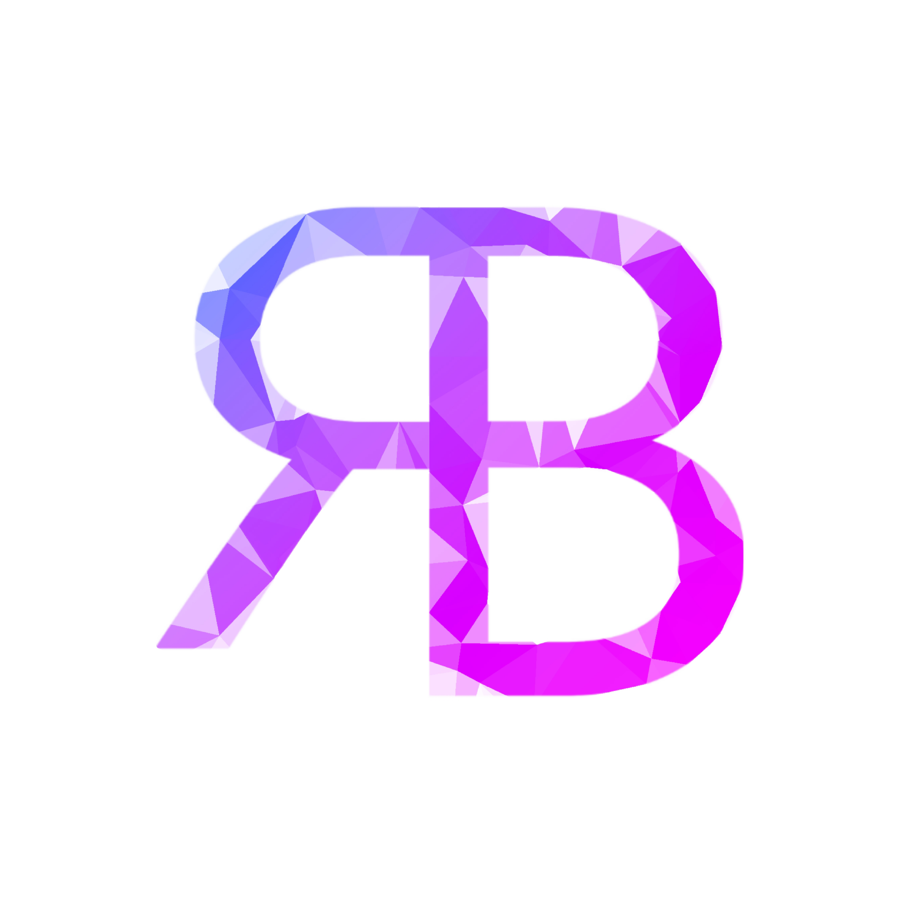
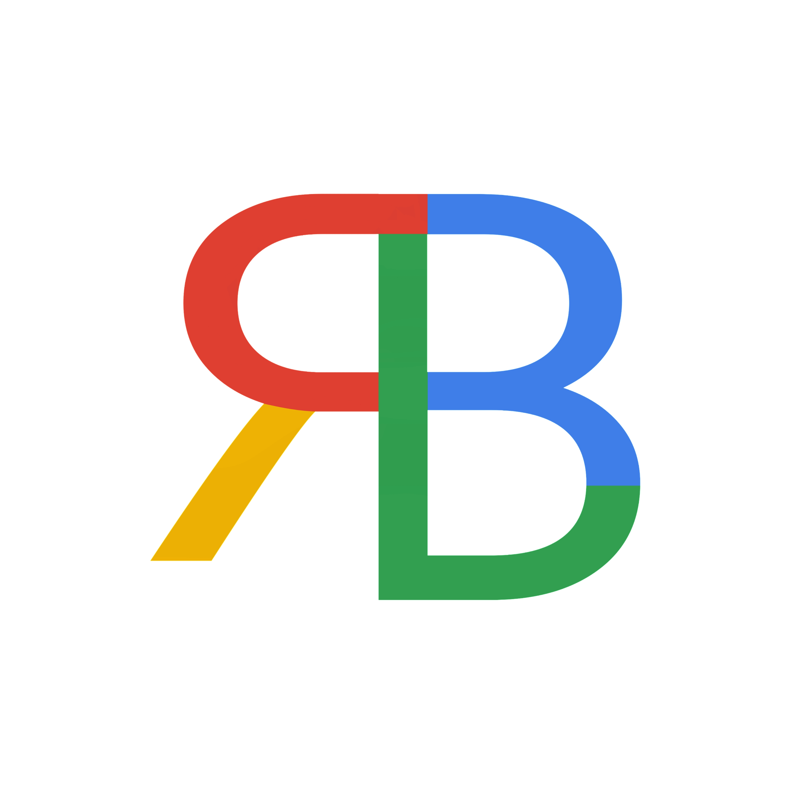

# Rodniel Briones Portfolio

This is my portfolio website created with Html, Css, Javascript, GSAP and Passion.

 

> **Issues:**
>
> - For some occasions the document does'nt render properly, if this happens please try to resize the window
> - Navigating the document using the "TAB" key will break the layout, this issue is not yet handled and will be fixed soon.
>    

 

[Browse Portfolio](https://scinth.github.io)

---

### Features

- bottom navigation on mobile
- swipe navigation on mobile
- random push animation on section navigation
- section navigation using arrow keys

 

 &nbsp;
 &nbsp;

 
 

For any concerns, please reach out to me at 
[ rodnielbriones@gmail.com](rodnielbriones@gmail.com)
