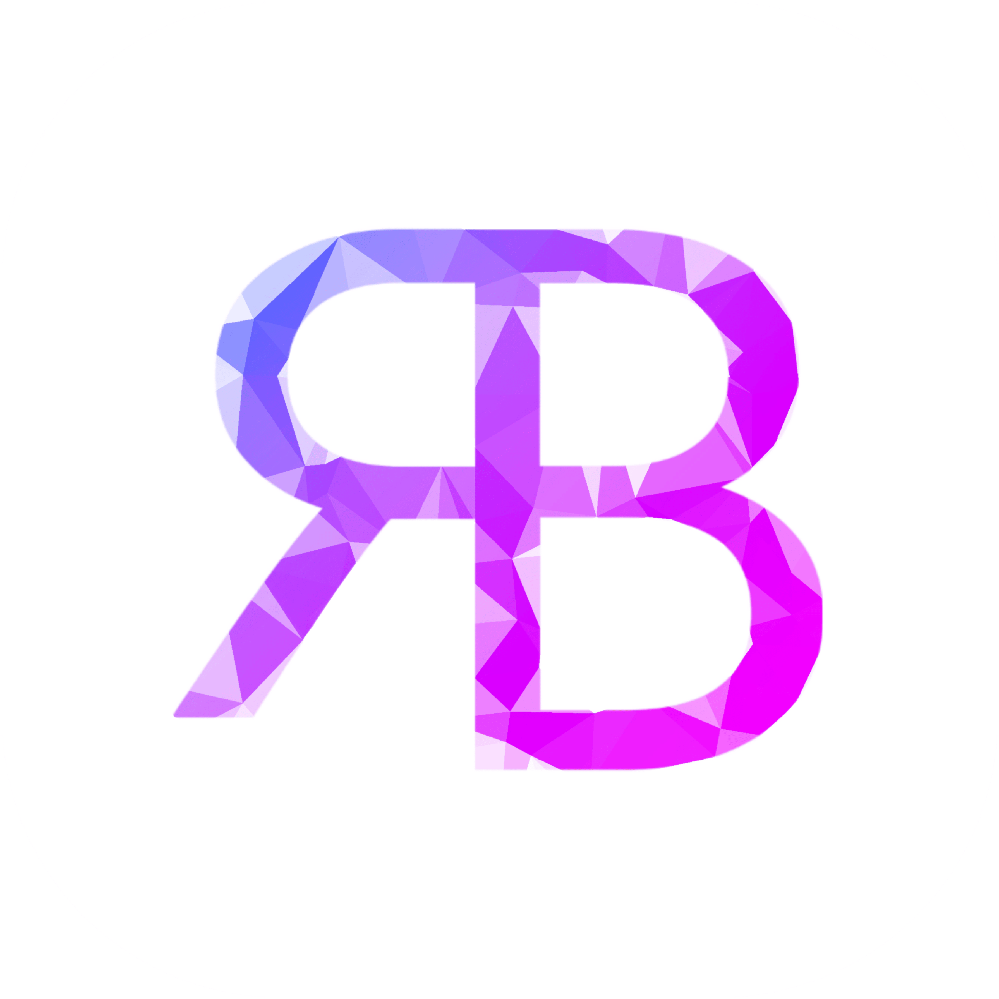

# Rodniel Briones Portfolio

This is my portfolio website created with Html, Css, Javascript, GSAP and Passion.

 

> **Note:**
> Navigating the document using the "TAB" key will break the layout, this issue is not yet handled and will be fixed soon.

---

### Features

- bottom navigation on mobile
- swipe navigation on mobile
- random push animation on page navigation
- page navigation using arrow keys

 

 &nbsp;
 &nbsp;

 
 

For any concerns, please reach out to me at 
[ rodnielbriones@gmail.com](rodnielbriones@gmail.com)
